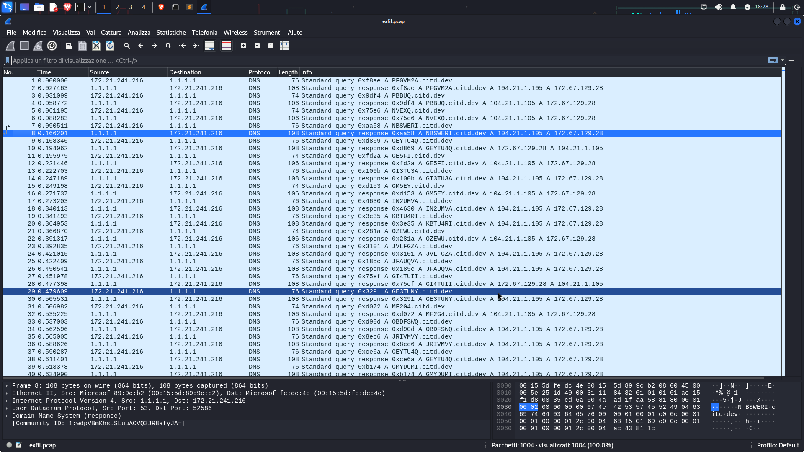

Inziamo la challenge scaricando il file pcap che ci viene fornito ed aprendolo con wireshark.
Questo è quello che abbiamo davanti:
	

	
nel pcap è presente solo traffico DNS con pacchetti anomali.
Ad occhio è però ovvio che si tratta di esfiltrazione DNS, in cui si esfiltrano dati dalla macchina vittima
attraverso query DNS verso server malevoli (anche se in questo caso le query sono verso il DNS di cloudflare 1.1.1.1 e secondario 1.0.0.1), maggiori info qui:
<!-->
https://helgeklein.com/blog/dns-exfiltration-tunneling-how-it-works-dnsteal-demo-setup/
<!-->
per estrarre i dati infatti ci basterà eseguire questo comando tshark per selezionare i dati che vogliamo:
	
	tshark -r exfil.pcap -Y 'ip.src==172.21.241.216' -T fields -e 'dns.qry.name' > dns_query.txt
una volta fatto questo ci ritroveremo una lista di query come questa:
	
	PFGVM2A.citd.dev
	PBBUQ.citd.dev
	NVEXQ.citd.dev
	NBSWERI.citd.dev
	GEYTU4Q.citd.dev
	GE5FI.citd.dev
	GI3TU3A.citd.dev
	GM5EY.citd.dev
	IN2UMVA.citd.dev
	[...]
perciò quello che dovremo fare è isolare ogni subdomain e decodarlo da base32 aggiungendo l'opportuno padding (=)
<!-- >
<!-->
Una volta decodificato un paio di stringhe possiamo notare che alcuni caratteri sono riempitivi e creano solo rumore,
mentre altri sono i caratteri della flag in ordine sparso con questo formato:
	
	echo GEYTU4Q= | base32 -d
output:
	
	11:r
Purtoppo sono in ordine sparso, ma per ordinarli ho scritto uno script python per automatizzare il tutto:
```python	
#!/bin/env python3
import base64


#inizializzo il dizionario flag
flag_chars = {}

print('[*]Exploit by Disturbante')

#apriamo il file creando un handle
with open('dns_query.txt','r')as f:
	#leggiamo ogni riga
	for line in f:
		#togliamo le parti superflue
		line = line.replace('.citd.dev\n','')
		#controlliamo il padding da aggiungere
		if (len(line)==7):
			line += '='
			#decodifichiamo la stringa
			decoded = base64.b32decode(line).decode()
			#controlliamo che non sia una stringa di riempimento
			if decoded[0].isdigit():
				separated = decoded.split(':')
				#aggiungiamola all'array dei caratteri della flag
				flag_chars[separated[0]] = separated[1]
		#ripetiamo il passaggio anche per i caratteri con padding diverso
		else:
			line += '==='
			decoded = base64.b32decode(line).decode()
			if decoded[0].isdigit():
				separated = decoded.split(':')
				flag_chars[separated[0]] = separated[1]
#infine ordiniamo l'array
flag_dict = dict(sorted(flag_chars.items()))
#creiamo una lista con indice crescente
flag_sorted = {k: flag_dict[k] for k in sorted(flag_dict, key=lambda x: int(x))}
#stampiamo i caratteri della flag tutti attaccati
print('[*]------------------------------->')
for valore in flag_sorted.values():
    print(valore, end='')
print('\n[*]------------------------------->')
```
se vogliamo fare tutto in automatico basterà aggiungere questa riga sotto il primo import:
```python
import os

os.system("tshark -r exfil.pcap -Y 'ip.src==172.21.241.216' -T fields -e 'dns.qry.name' > dns_query.txt")
```
così da non dover faticare troppo =)
<!-->
Questo è lo script completo 
